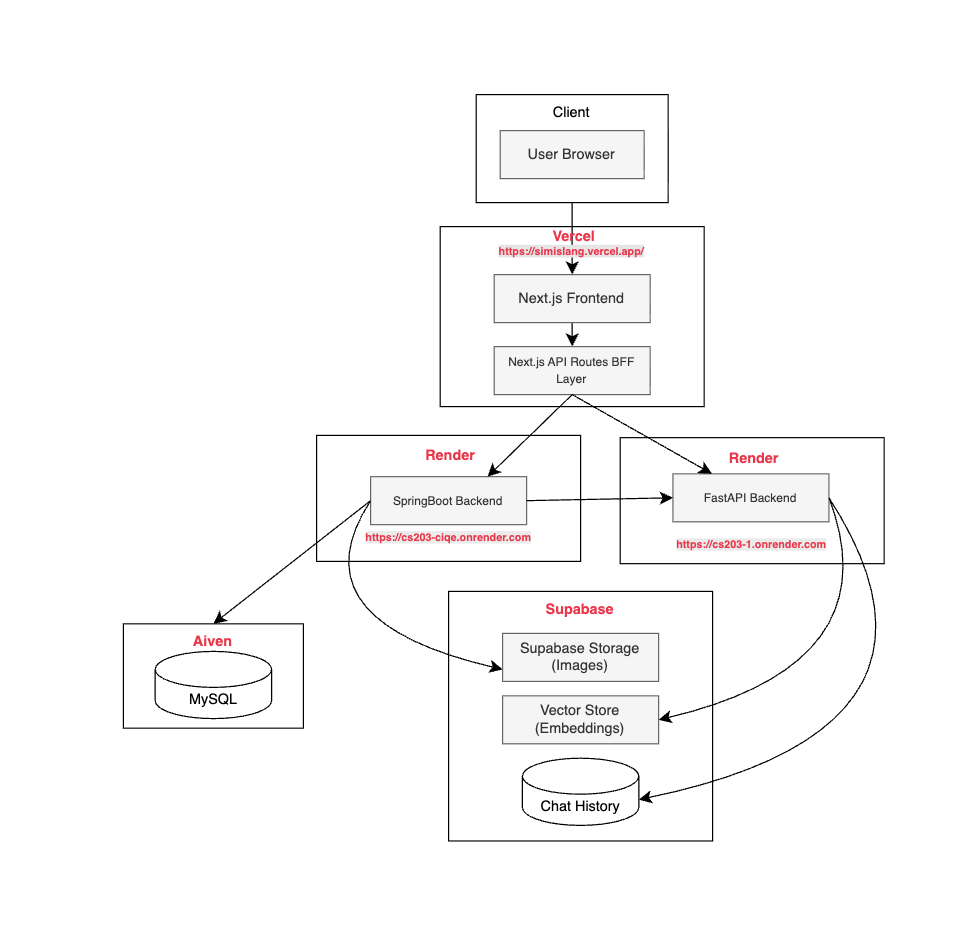

# 🧠 SimiSlang — Community-Driven Gen Alpha Slang Learning Platform

## 🌐 Live Demo
👉 https://simislang.vercel.app/

---

## 📌 Overview

**SimiSlang** is a community-driven self-learning platform designed to help users **access, create, and verify lessons on Gen Alpha slang**.

The platform enhances comprehension by integrating **AI to contextualize slang using localized Singlish equivalents**, making learning more culturally relatable and intuitive.

To further support learning:
- **AI-powered learning assistants** provide real-time clarification  
- A **community verification system** ensures content accuracy  
- Reduces misinformation and low-quality AI-generated content  

---

## 🎯 Project Objectives

- Enable users to **learn Gen Alpha slang in a structured lesson format**
- Provide **AI-assisted explanations using localized Singlish context**
- Allow users to **create, rate, and verify lesson content**
- Reduce **AI hallucination ("AI slop")** via validation systems
- Promote **collaborative, self-paced learning**

---

## ✨ Key Features

### 📚 Lesson Learning System
- Structured: Lessons → Chapters → Cards → Quizzes  
- Progress tracking & learning streaks  
- Tag-based filtering  

### 🤖 AI Learning Assistant
- Context-aware slang explanations  
- Singlish-based contextualisation  
- Interactive chatbot  

### 👥 Community Verification
- Lesson rating & feedback  
- Peer validation of AI content  
- Moderation system  

### 🧑‍💻 User & Social Features
- User profiles & achievements  
- Friend system  
- Personalized dashboard  

---

## 🏗️ Tech Stack

### Frontend
- Next.js (App Router)  
- Tailwind CSS  
- Axios *(⚠️ Avoid latest version as of 1 Apr 2026 due to security concerns)*  

### Backend
- Java Spring Boot  
- Spring Security (JWT Authentication)  

### Database & Vector Store
- MySQL  
- Supabase  

### Storage
- Supabase Storage  

### AI Services
- Ollama Cloud gpt-oss-120B (LLM for chatbot & explanations)  
- `google/embeddinggemma-300M` (embedding model)  
- Supabase RPC for Hybrid Search (Keyword + Semantic via RRF)  
- DeepEval (LLM-as-a-judge for detecting low-quality AI content)  

---

## 🧩 System Architecture



---

# backend-ai

FastAPI service powering the Gen Alpha slang chatbot. Uses a LangGraph agent with RAG retrieval, long-term memory, and multi-route query handling.

## LangGraph Graph

### State

```python
class GraphState(TypedDict):
    messages: Annotated[list[BaseMessage], add_messages]  # conversation history
    route: str        # classification result: "singlish" | "video" | "general"
    rag_context: str  # retrieved documents from the vector store
```

### Graph Flow

```
START
  │
  ▼
┌─────────┐
│ classify │  ── classifies query into: singlish | video | general
└─────────┘
  │ (conditional: all routes → run_rag)
  ▼
┌─────────┐
│ run_rag  │  ── hybrid semantic + full-text search against Supabase vector store
└─────────┘
  │ (conditional: branches on stored route)
  ├── singlish ──► ┌───────────────────┐
  │                │ singlish_translate │ ── explains slang in Singlish style
  │                └───────────────────┘
  │                         │
  ├── video ────► ┌──────────────┐      ▼
  │               │ video_search  │ ── Tavily search on YouTube/TikTok → markdown table
  │               └──────────────┘
  │                         │
  └── general ──► ┌────────────┐        ▼
                  │ call_model  │ ── general slang Q&A with long-term memory
                  └────────────┘
                           │
                           ▼
                          END
```

### Nodes

| Node | Description |
|------|-------------|
| `classify` | Calls Ollama to classify the user query as `singlish`, `video`, or `general`. Stores result in `state["route"]`. |
| `run_rag` | Shared retrieval step for all routes. Embeds the user query via HuggingFace API and calls `hybrid_search_filtered` RPC on Supabase (top 5 `card`-type documents). Result stored in `state["rag_context"]`. |
| `singlish_translate` | Uses RAG context to explain the slang term in Singlish style (lah, leh, lor, etc.) with three sections: *What it means*, *When to use it*, *Example*. |
| `video_search` | Calls Tavily to find YouTube/TikTok videos about the slang term. Returns a markdown table of results. |
| `call_model` | General slang explanation using RAG context. Reads user memories from PostgreSQL store (`namespace = ("memories", user_id)`) and appends the current message as a new memory. |

### Edges

| From | To | Type | Condition |
|------|----|------|-----------|
| `START` | `classify` | Direct | — |
| `classify` | `run_rag` | Conditional | All three routes map to `run_rag` |
| `run_rag` | `singlish_translate` | Conditional | `route == "singlish"` |
| `run_rag` | `video_search` | Conditional | `route == "video"` |
| `run_rag` | `call_model` | Conditional | `route == "general"` |
| `singlish_translate` | `END` | Direct | — |
| `video_search` | `END` | Direct | — |
| `call_model` | `END` | Direct | — |

### Persistence

- **Checkpointer** — `AsyncPostgresSaver` (Supabase): persists full conversation history per `thread_id`.
- **Store** — `AsyncPostgresStore` (Supabase): persists long-term user memories per `user_id`, used by `call_model`.

### External Services

| Service | Purpose |
|---------|---------|
| Ollama | Cloud LLM for classification and response generation |
| Supabase | Vector store (pgvector) + PostgreSQL for checkpointing and memory |
| HuggingFace API | Text embedding for RAG queries |
| Tavily | Video search (YouTube, TikTok) |

## Key Files

- [graph/builder.py](graph/builder.py) — graph definition, all node implementations, `build_graph_with_memory()`
- [graph/tools.py](graph/tools.py) — `rag_search` and `tavily_video_search` LangChain tools
- [app.py](app.py) — FastAPI app, graph initialization, `/chat` endpoint

---

## 🚀 Getting Started

### ✅ Prerequisites

- Node.js (v18+)  
- Java 21  
- MySQL  
- Python 3.10+  
- Ollama  
- Supabase Project  

---

## 🔧 Setup Instructions

### 🔹 Frontend

```bash
cd frontend
npm install
npm run dev
```

### 🔹 Backend
```bash
cd backend
./mvnw spring-boot:run
```
### 🔹 Backend-ai
```bash
cd backend-ai
python -m venv venv
source venv/bin/activate   # Mac/Linux
venv\Scripts\activate      # Windows

pip install -r requirements.txt
uvicorn app:app --reload --port 5000
```

## ⚙️ Environment Variables

### 🖥️ Frontend .env
```bash
NEXT_PUBLIC_BACKEND_PUBLIC_BASE=http://localhost:3000
BACKEND_URL=http://localhost:7860
AI_BACKEND_URL=http://localhost:5000
```

### 🖥️ Backend .env
```bash
DB_HOST=your_database_host
DB_USER=root
DB_PASSWORD=yourpassword
DB_NAME=your_database_name
DB_PORT=3306

JWT_SECRET=your_jwt_secret

SUPABASE_URL=your_supabase_url
SUPABASE_SERVICE_TOKEN=your_service_token
SUPABASE_STORAGE_BUCKET=your_bucket_name

RESEND_API_KEY=your_api_key
RESEND_FROM_EMAIL=your_email
```

### 🖥️ Backend-ai .env
```bash
SUPABASE_URL=your_supabase_url
SUPABASE_KEY=your_supabase_key
SUPABASE_DB_URI=your_supabase_uri

EMBEDDING_API_URL=your_embedding_api
HF_TOKEN=your_huggingface_token

OLLAMA_MODEL=llama3
OLLAMA_BASE_URL=http://localhost:11434
OLLAMA_API_KEY=

CORS_ORIGINS=http://localhost:3000
VERDICT_THRESHOLD=0.7

TAVILY_API_KEY=your_tavily_api_key
JWT_SECRET=your_jwt_secret
```

## 🤝 Contributors
### SMU CS203 G1 Team 4
- Zion Tan Yi En
- Soon Shi Heng Kevan
- Ong Jiong Hui
- Muhammad Ashraf Bin Mustafa
- Wee Lu Xuan
- Darrion Ong Wei Zhi 
